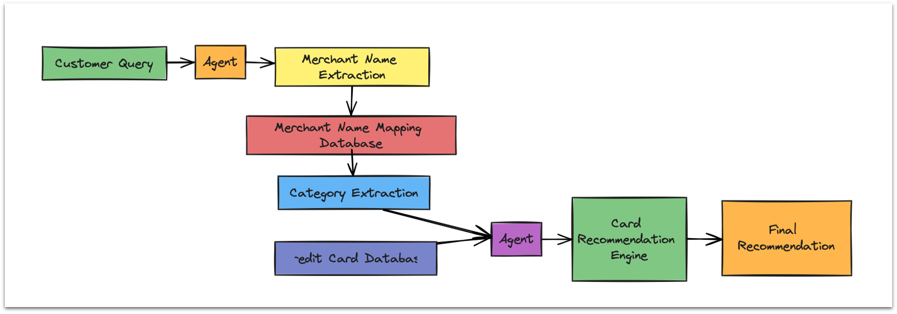

# Spendify: Make Every Purchase a Reward

## Introduction

**Spendify** is a smart shopping assistant that helps users maximize their savings by recommending the best credit card for each purchase. The project leverages AI to ensure users make informed decisions and benefit from the best available offers and rewards.

**[Check out the full presentation here](https://docs.google.com/presentation/d/1pG5DHT_B81xjnGnlfbMNagZcRdrHIjZ3/edit#slide=id.p12)


## Problem Statement

Consumers often struggle to keep track of the best credit card offers, rewards, and benefits. They miss out on savings and special offers because they don't have a tool to assist them in selecting the best credit card for each purchase.

## Solution: Spendify

Spendify simplifies the shopping journey by guiding users through the process of selecting the most beneficial credit card for their purchases. The tool provides real-time recommendations based on the user's spending habits and the available credit card offers.
# Spendify - Credit Cards Score


### Key Features

- **Smart Shopping Journey**: Guides users through the steps of selecting and using the best credit card.
- **Credit Card Recommendations**: Provides personalized recommendations for maximizing rewards and savings.
- **Enhanced Shopping Experience**: Integrates with various merchants to deliver tailored advice.

## How It Works

Spendify operates through a series of steps:

1. **User Initiates a Purchase**: The user goes to a store and initiates a purchase.
2. **Request Recommendations**: Spendify analyzes the purchase details and available credit card offers.
3. **Provide Recommendations**: Spendify recommends the best credit card for the purchase.
4. **User Uses Recommended Card**: The user makes the purchase using the recommended card.
5. **Save Money**: The user benefits from the best rewards, cashback, or other offers available.



## Installation

To run Spendify locally, follow these steps:

### Backend Setup (Flask)

1. **Clone the Repository**:
   ```bash
   git clone https://github.com/your-username/spendify.git
   cd spendify
   ```

2. **Install Python Dependencies**:
   ```bash
   pip install -r requirements.txt
   ```

3. **Start the Flask Backend**:
   ```bash
   python pipeline.py
   ```
   The Flask server will start at `http://0.0.0.0:8000`.

### Frontend Setup (React)

1. **Navigate to the UI Directory**:
   ```bash
   cd ui
   ```

2. **Install Node.js Dependencies**:
   ```bash
   npm install
   ```

3. **Start the React Frontend**:
   ```bash
   npm start
   ```
   The React development server will start at `http://localhost:3000`.

### Running Both Backend and Frontend Together

You can automate the startup process using a script:

1. **Create and Run the Start Script**:
   ```bash
   ./start.sh
   ```
   This will start both the backend and frontend servers.

### Team
- Maryam,Rohit, Reza, Guna
